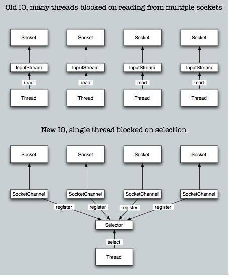
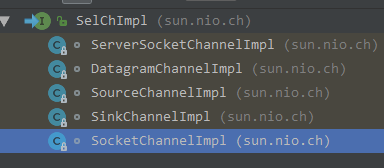
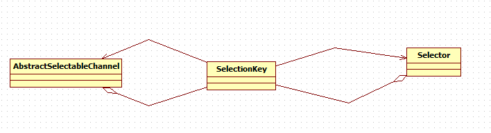

# java nio简介

java.nio全称java non-blocking IO，是指jdk1.4 及以上版本里提供的新api（New IO） ，为所有的原始类型（boolean类型除外）提供缓存支持的数据容器，使用它可以提供非阻塞式的高伸缩性网络。

<!--more-->

# 使用demo

## server端代码

```
        ServerSocketChannel serverSocketChannel = ServerSocketChannel.open();
        serverSocketChannel.configureBlocking(false);
        serverSocketChannel.socket().bind(new InetSocketAddress(port));

        Selector selector = Selector.open();
        serverSocketChannel.register(selector, SelectionKey.OP_ACCEPT);

        while (true) {
            selector.select();
            Set<SelectionKey> selectionKeys = selector.selectedKeys();
            System.out.println(selectionKeys.size());
            Iterator<SelectionKey> iterator = selectionKeys.iterator();
            while (iterator.hasNext()) {
                SelectionKey selectionKey = iterator.next();
                // 删除已选的key 以防重复处理
                iterator.remove();
                if (selectionKey.isAcceptable()) {//如果有客户端连接进来
                    // 先拿到这个SelectionKey里面的ServerSocketChannel。
                    ServerSocketChannel serverSocketChannel1 = (ServerSocketChannel) selectionKey.channel();
                    // 获得和客户端连接的通道
                    SocketChannel socketChannel = serverSocketChannel1.accept();
                    socketChannel.configureBlocking(false);//将此通道设置为非阻塞

                    //为了接收客户端发送过来的数据，需要将此通道绑定到选择器上，并为该通道注册读事件
                    socketChannel.register(selector, SelectionKey.OP_READ);
                } else if (selectionKey.isReadable()) {//客户端发送数据过来了
                    //先拿到这个SelectionKey里面的SocketChannel。
                    SocketChannel socketChannel = (SocketChannel) selectionKey.channel();
                   
            ByteBuffer buf = ByteBuffer.allocate(100);
            try {
                if (socketChannel.read(buf) <= 0) {
                    return;
                }
                byte[] receivedData = buf.array();
                String msg = new String(receivedData).trim();
                System.out.println("receivedData：" + msg);
                buf.clear();
                socketChannel.write(ByteBuffer.wrap("收到信息!!!".getBytes()));
            } catch (Exception e) {
                e.printStackTrace();
            }
                }
            }
        }
```


## client端代码

```
        socketChannel = SocketChannel.open(new InetSocketAddress(this.host, this.port));
        socketChannel.configureBlocking(false);

        // 打开并注册选择器到信道
        Selector selector = Selector.open();
        socketChannel.register(selector, SelectionKey.OP_READ);

                while (true) {
                    try {
                        selector.select();
                        Set<SelectionKey> set = selector.selectedKeys();
                        Iterator<SelectionKey> ite = set.iterator();

                        while (ite.hasNext()) {
                            SelectionKey selectionKey = ite.next();
                            ite.remove(); //删除已选的key,以防重复处理
                            if (selectionKey.isConnectable()) {//看是否有连接发生
                                SocketChannel socketChannel = (SocketChannel) selectionKey.channel();
                                //如果正在连接，则完成连接
                                if (socketChannel.isConnectionPending()) {
                                    socketChannel.finishConnect();
                                }
                                socketChannel.configureBlocking(false);//设置为非阻塞模式
                                //给服务器端发送数据
                                System.out.println("客户端连接上了服务器端。。。。");
                                //为了接收来自服务器端的数据，将此通道注册到选择器中
                                socketChannel.register(selector, SelectionKey.OP_READ);
                            } else if (selectionKey.isReadable()) {
                                SocketChannel socketChannel = (SocketChannel) selectionKey.channel();
                                //接收来自于服务器端发送过来的数据
                                ByteBuffer buf = ByteBuffer.allocate(1024);
                                socketChannel.read(buf);
                                byte[] receiveData = buf.array();
                                String msg = new String(receiveData).trim();
                                System.out.println("接收来自服务器端的数据为：" + msg);
                                buf.clear();
                            }
                        }
                    } catch (Exception e) {
                        e.printStackTrace();
                    }
                }
```

# java nio与io编程区别

- io是基于流stream编程的，流没有读完或者写完，线程会阻塞
- nio是基于缓冲区编程的，通过selector获取准备好的channel，从channel中获取数据到缓冲区，然后处理缓冲区数据。从select获取准备好的channel是一种通知机制。

基于流编程是一个线程将流处理完，处理起来比较简单，但是向网络编程这种，多个连接的数据传输，就会多个线程，线程多就会增加线程切换带来的性能损耗。

基于nio的网络编程，使用一个selector来管理这些连接，当有事件发生时再处理。可以通过与cpu核心数相同大小的线程池来处理事件，这样就会减少线程切换。但是带来更加复杂的编程逻辑，因为缓冲区有大小限制，需要自行处理大数据传输缓冲区数据的拼接。

简单的说，selector的原理是使用一个selector来管理多个socket，当socket上有事件发生是，selector会把这个socket找出来，进行io处理。

用一张图，简单的描述io 和 nio区别



# java nio socket selector模型原理

要使用selector模型，需要将channel注册到selector上，服务端和客户端注册方式分别为：
```
    serverSocketChannel.register(selector, SelectionKey.OP_ACCEPT);
    socketChannel.register(selector, SelectionKey.OP_READ);
```
`register`方法有两个重载的方法，返回一个`SelectionKey`
```
    public final SelectionKey register(Selector sel, int ops)
    public abstract SelectionKey register(Selector sel, int ops, Object att)
```
第二个方法多一个att参数，可以注册时增加一个附加的对象，用返回的`SelectionKey`可以设置这个att，注意这个att，非常有用，可以放需要的任意对象。

注册得到的这个`SelectionKey`是selector模型中的关键，我们看看SelectionKeyImpl的源代码
```
public class SelectionKeyImpl extends AbstractSelectionKey {
    final SelChImpl channel;
    public final SelectorImpl selector;
    private int index;
    private volatile int interestOps;
    private int readyOps;
。。。
}
```
- `SelectorImpl` selector是所注册的选择器
- `interestOps`是所关心的操作事件集合，是一个int类型，使用二进制的位来组合不同时间集合
- `readyOps`是准备好的操作事件

在channel上有四种：
```
    public static final int OP_READ = 1 << 0;//可读
    public static final int OP_WRITE = 1 << 2;//可写
    public static final int OP_CONNECT = 1 << 3;//准备好连接
    public static final int OP_ACCEPT = 1 << 4;//serverSoket接收连接
```

`SelectionKeyImpl` 的父类`SelectionKey`有一个属性`attachment` ，就是前文我们提到的注册时可以传入的对象。
```
    private volatile Object attachment = null;
```

`SelectionKey`还提供两个方法`public final Object attach(Object ob)`和`public final Object attachment()`，或可以设置和获取`attachment`。

`SelectionKeyImpl` 的属性channel是`SelChImpl`类型，是所有`Selectable  Channel`的接口



`SelectionKeyImpl`是一个接口，源代码如下：
```
public interface SelChImpl extends Channel {
    FileDescriptor getFD();
    int getFDVal();
    boolean translateAndUpdateReadyOps(int var1, SelectionKeyImpl var2);
    boolean translateAndSetReadyOps(int var1, SelectionKeyImpl var2);
    void translateAndSetInterestOps(int var1, SelectionKeyImpl var2);
    int validOps();
    void kill() throws IOException;
}
```

在看看实现类`SocketChannel`的源代码：
```
class SocketChannelImpl extends SocketChannel implements SelChImpl {
    private static NativeDispatcher nd;
    private final FileDescriptor fd;
    private final int fdVal;
    private volatile long readerThread = 0L;
    private volatile long writerThread = 0L;
    private final Object readLock = new Object();
    private final Object writeLock = new Object();
    private final Object stateLock = new Object();
    private boolean isReuseAddress;
    private static final int ST_UNINITIALIZED = -1;
    private static final int ST_UNCONNECTED = 0;
    private static final int ST_PENDING = 1;
    private static final int ST_CONNECTED = 2;
    private static final int ST_KILLPENDING = 3;
    private static final int ST_KILLED = 4;
    private int state = -1;
    private InetSocketAddress localAddress;
    private InetSocketAddress remoteAddress;
    private boolean isInputOpen = true;
    private boolean isOutputOpen = true;
    private boolean readyToConnect = false;
    private Socket socket;
。。。
}
```

这里有个很重要的属性，`FileDescriptor` fd，就是操作系统对socket的文件描述符，可以再看看`SocketImpl`的源代码，也有个`FileDescriptor` fd属性，这里是同一个。

文件描述符是一个简单的整数，用以标明每一个被进程所打开的文件和socket。可以理解为一个数组的索引，数组里面放着文件和socket相关的信息。

了解了`SelectionKey`和`Channel`的结构，我们再来看看注册到selector的过程。channel注册到selector是调用的`AbstractSelectableChannel.register`方法：
```
    public final SelectionKey register(Selector sel, int ops, Object att)
        throws ClosedChannelException
    {
        synchronized (regLock) {
            //先校验
            if (!isOpen())
                throw new ClosedChannelException();
            if ((ops & ~validOps()) != 0)
                throw new IllegalArgumentException();
            if (blocking)
                throw new IllegalBlockingModeException();
            //在本地keys数组中找SelectionKey，如果找到了，直接设置关心的操作和att对象
            SelectionKey k = findKey(sel);
            if (k != null) {
                k.interestOps(ops);
                k.attach(att);
            }
            //没有找到，新注册SelectionKey ，并放到本地数组中缓存
            if (k == null) {
                // New registration
                synchronized (keyLock) {
                    if (!isOpen())
                        throw new ClosedChannelException();
                    k = ((AbstractSelector)sel).register(this, ops, att);
                    addKey(k);
                }
            }
            return k;
        }
    }
```

新注册`SelectionKey` 是调用selector的`register`方法：
```
    protected final SelectionKey register(AbstractSelectableChannel var1, int var2, Object var3) {
        if (!(var1 instanceof SelChImpl)) {
            throw new IllegalSelectorException();
        } else {
            //新建一个SelectionKeyImpl ，传入channel，和seletecor，设置attachment，设置关心的操作
            SelectionKeyImpl var4 = new SelectionKeyImpl((SelChImpl)var1, this);
            var4.attach(var3);
            Set var5 = this.publicKeys;
            synchronized(this.publicKeys) {
                //调用SelectorImpl的抽象方法implRegister注册SelectionKeyImpl 
                this.implRegister(var4);
            }
            var4.interestOps(var2);
            return var4;
        }
    }
```

`implRegister`根据操作系统有不同的实现。

## windows上的实现

我们先看看windows下如何实现的。
```
SelectorImpl在windows下子类是WindowsSelectorImpl，implRegister方法代码如下：
    protected void implRegister(SelectionKeyImpl var1) {
        Object var2 = this.closeLock;
        synchronized(this.closeLock) {
            if (this.pollWrapper == null) {
                throw new ClosedSelectorException();
            } else {
                this.growIfNeeded();
                this.channelArray[this.totalChannels] = var1;
                var1.setIndex(this.totalChannels);
                this.fdMap.put(var1);
                this.keys.add(var1);
                this.pollWrapper.addEntry(this.totalChannels, var1);
                ++this.totalChannels;
            }
        }
    }
```

这里把`SelectionKey`加到`SelectorImpl`中的好多地方`channelArray`、`fdMap`、`keys`、`pollWrapper`。加到每个地方的作用，我们先不管，后面再看，反正是保存在属性里面了。有个问题，连接关闭了的话，什么时候释放呢？ 后面我们会分析到。

从`selector.select()`方法往里面跟，跟到`SelectorImpl`的：
```
    private int lockAndDoSelect(long var1) throws IOException 
```

再跟到`WindowsSelectorImpl`的
```
protected int doSelect(long var1) throws IOException {
。。。
            //先处理注销的key，通过selector调用cancel方法注销selectionKey
            this.timeout = var1;
            this.processDeregisterQueue();
            if (this.interruptTriggered) {
                this.resetWakeupSocket();
                return 0;
。。。
                    try {
                        //这里阻塞住
                        this.subSelector.poll();
                    } catch (IOException var7) {
                        this.finishLock.setException(var7);
                    }
。。。
                this.finishLock.checkForException();
                this.processDeregisterQueue();
                //更新SelectedKeys
                int var3 = this.updateSelectedKeys();
                this.resetWakeupSocket();
                return var3;
            }
        }
    }
```

重要的两行代码是`this.subSelector.poll();`和 `this.updateSelectedKeys();`

先看`subSelector.poll()`，跟到
```
        private int poll() throws IOException {
            return this.poll0(WindowsSelectorImpl.this.pollWrapper.pollArrayAddress, Math.min(WindowsSelectorImpl.this.totalChannels, 1024), this.readFds, this.writeFds, this.exceptFds, WindowsSelectorImpl.this.timeout);
        }
        private native int poll0(long var1, int var3, int[] var4, int[] var5, int[] var6, long var7);
```

这里`poll0`是一个native方法，再往下跟就需要看jdk的源代码了。

简单的解释下，这里用到了`pollWrapper`，我们回头看看之前注册的代码`this.pollWrapper.addEntry(this.totalChannels, var1);`这里面实际上是将`SelectionKey`的fd值放在`pollWrapper`内部的数组中，可参考`PollArrayWrapper`的代码。

`poll0()`方法第一个参数为fd开始的地址，第二个是fd数量，后面三个fd数组分别是：保存发生read的FD，保存发生write的FD ，保存发生except（错误）的FD ，最后一个是超时时间。poll0（）会监听pollWrapper中的FD有没有数据进出，这会造成IO阻塞，直到有数据读写事件发生，然后将发生数据的分别保存在read/write/except数组中。

poll到发生事件的fd后，需要将找到这些fd对应的`SelectionKey`，通过`updateSelectedKeys`实现的：
```
    private int updateSelectedKeys() {
        ++this.updateCount;
        byte var1 = 0;
        int var4 = var1 + this.subSelector.processSelectedKeys(this.updateCount);
        WindowsSelectorImpl.SelectThread var3;
        for(Iterator var2 = this.threads.iterator(); var2.hasNext(); var4 += var3.subSelector.processSelectedKeys(this.updateCount)) {
            var3 = (WindowsSelectorImpl.SelectThread)var2.next();
        }
        return var4;
    }
        private int processSelectedKeys(long var1) {
            byte var3 = 0;
            int var4 = var3 + this.processFDSet(var1, this.readFds, Net.POLLIN, false);
            var4 += this.processFDSet(var1, this.writeFds, Net.POLLCONN | Net.POLLOUT, false);
            var4 += this.processFDSet(var1, this.exceptFds, Net.POLLIN | Net.POLLCONN | Net.POLLOUT, true);
            return var4;
        }
```

在看看`processFDSet`方法：
```
        private int processFDSet(long var1, int[] var3, int var4, boolean var5) {
            。。。
        }
```

代码有点多，主要是根据前面保存三类fd数组找出`selectionKey`，加到`selectedKeys`中。前面注册的时候，将`SelectionKey`放到fdMap中，这里就从`fdMap`中根据fd找到`SelectionKey`。

后续通过
```
Set<SelectionKey> set = selector.selectedKeys();
```
得到的`SelectionKey`集合就是这个这里加进来的，注意，我们遍历set时，拿出一个key，就要从set中删除掉，避免重复消费。

后面就是根据这个`SelectionKey`获取到`SocketChannel`，从`SocketChannel`中读取数据到`ByteBuffer`，处理业务逻辑。

到这里，我们就把channel注册到selector，到selector如何取到有事件发生的channel的过程分析完了，接下来我们看看通道关闭时，如何从selector中注销的。

从`socketChannel.close()`开始，找到`implCloseChannel()`，找到`AbstractSelectableChannel.implCloseChannel`：
```
    protected final void implCloseChannel() throws IOException {
        implCloseSelectableChannel();
        synchronized (keyLock) {
            int count = (keys == null) ? 0 : keys.length;
            for (int i = 0; i < count; i++) {
                SelectionKey k = keys[i];
                if (k != null)
                    k.cancel();
            }
        }
    }
```

`implCloseSelectableChannel()`先关闭chanel，然后逐个调用 `k.cancel()`取消`SelectionKey`，在往`k.cancel()`方法里面跟：
```
    public final void cancel() {
        synchronized (this) {
            if (valid) {
                valid = false;
                ((AbstractSelector)selector()).cancel(this);
            }
        }
    }
```

调用`selector`的`cancel`方法，再跟进去
```
    void cancel(SelectionKey k) { 
        synchronized (cancelledKeys) {
            cancelledKeys.add(k);
        }
    }
```

将需要关闭的key加入到`cancelledKeys`集合中。啥时候处理这些关闭的key呢？先在`AbstractSelector`类中找`cancelledKeys`的用处，发现没有，再找子类`SelectorImpl`，发现：
```
    void processDeregisterQueue() throws IOException {
        Set var1 = this.cancelledKeys();
        synchronized(var1) {
            if (!var1.isEmpty()) {
                Iterator var3 = var1.iterator();
                while(var3.hasNext()) {
                    SelectionKeyImpl var4 = (SelectionKeyImpl)var3.next();
                    try {
                        this.implDereg(var4);
                    } catch (SocketException var11) {
                        throw new IOException("Error deregistering key", var11);
                    } finally {
                        var3.remove();
                    }
                }
            }
        }
    }
```

这里会调用`implDereg`实现注销`SelectionKey`，再找`processDeregisterQueue`方法被调用的地方，前文中我们已经分析过的代码，在`WindowsSelectorImpl.doSelect`里面会先调用`processDeregisterQueue`。

分析到这里，windows上的select的整个过程就完成了。

## linux上的实现

下面我们分析下linux下是如何实现。

我们用jd-gui打开linux下的rt.jar，也可以直接在linux下用eclipse或者idea打开源代码。

从这行代码开始往下跟，看看获取的`Selector`是哪个类
```
        Selector selector = Selector.open();
```

跟到：
```
    public static Selector open() throws IOException {
        return SelectorProvider.provider().openSelector();
    }
```

默认情况下使用`DefaultSelectorProvider`
```
SelectorProvider.access$102(DefaultSelectorProvider.create());
```

再跟进`sun.nio.ch.DefaultSelectorProvider.create`方法：
```
  public static SelectorProvider create()
  {
    String str = (String)AccessController.doPrivileged(new GetPropertyAction("os.name"));
    if (str.equals("SunOS")) {
      return createProvider("sun.nio.ch.DevPollSelectorProvider");
    }
    if (str.equals("Linux")) {
      return createProvider("sun.nio.ch.EPollSelectorProvider");
    }
    return new PollSelectorProvider();
  }
```

可以看到，操作系统名字为Linux时，直接使用`EPollSelectorProvider`，实际上`epoll`是`linux`内核2.6之后出现的。

`EPollSelectorProvider`创建`EPollSelectorImpl`。再看`EPollSelectorImpl`中注册`SelectionKey`的代码：
```
  protected void implRegister(SelectionKeyImpl paramSelectionKeyImpl)
  {
    if (this.closed) {
      throw new ClosedSelectorException();
    }
    SelChImpl localSelChImpl = paramSelectionKeyImpl.channel;
    int i = Integer.valueOf(localSelChImpl.getFDVal()).intValue();
    this.fdToKey.put(Integer.valueOf(i), paramSelectionKeyImpl);
    this.pollWrapper.add(i);
    this.keys.add(paramSelectionKeyImpl);
  }
```

又是把`SelectionKey`加到`SelectorImpl`中，包括`fdToKey`、`pollWrapper`、`keys`。

我们先看看选择器是如何选择这些key的。
```
protected int doSelect(long paramLong) throws IOException{
    if (this.closed)
        throw new ClosedSelectorException();
    processDeregisterQueue();
    try {
        begin();
        this.pollWrapper.poll(paramLong);
    } finally {
        end();
    }
    processDeregisterQueue();
    int i = updateSelectedKeys();
    if (this.pollWrapper.interrupted()){
        this.pollWrapper.putEventOps(this.pollWrapper.interruptedIndex(), 0);
        synchronized (this.interruptLock) {
            this.pollWrapper.clearInterrupted();
            IOUtil.drain(this.fd0);
            this.interruptTriggered = false;
        }
    }
    return i;
}
```

跟windows的代码有点类似，可以看到重点是调用了`this.pollWrapper.poll(paramLong);`

再来看`EPollArrayWrapper.poll`方法：
```
  int poll(long paramLong)    throws IOException  {
    updateRegistrations();
    this.updated = epollWait(this.pollArrayAddress, NUM_EPOLLEVENTS, paramLong, this.epfd);
    for (int i = 0; i < this.updated; i++) {
      if (getDescriptor(i) == this.incomingInterruptFD)
      {
        this.interruptedIndex = i;
        this.interrupted = true;
        break;
      }
    }
    return this.updated;
  }
  private native int epollWait(long paramLong1, int paramInt1, long paramLong2, int paramInt2)    throws IOException;
```

这里调用了本地的`epollWait`方法，大概解释下，第一个参数是拉出事件存放fd数组的地址，第二个是最大fd个数，第三个是超时时间，最后一个是epoll实例的fd，通过`epoll_create`创建的。

`epollWait`方法会等待注册在epoll实例上的fd的事件，有事件发生，会将这些fd放在`pollArrayAddress`指向的数组中，返回发生事件的fd个数。

我们再回到`EPollSelectorImpl`的`doSelect`方法，poll到事件，将事件对应的fd放在数组里面，然后调用`updateSelectedKeys`方法，根据fd值找到`SelectionKey`值
```
  private int updateSelectedKeys()
  {
    int i = this.pollWrapper.updated;
    int j = 0;
    for (int k = 0; k < i; k++)
    {
      int m = this.pollWrapper.getDescriptor(k);
      SelectionKeyImpl localSelectionKeyImpl = (SelectionKeyImpl)this.fdToKey.get(Integer.valueOf(m));
      if (localSelectionKeyImpl != null)
      {
        int n = this.pollWrapper.getEventOps(k);
        if (this.selectedKeys.contains(localSelectionKeyImpl))
        {
          if (localSelectionKeyImpl.channel.translateAndSetReadyOps(n, localSelectionKeyImpl)) {
            j++;
          }
        }
        else
        {
          localSelectionKeyImpl.channel.translateAndSetReadyOps(n, localSelectionKeyImpl);
          if ((localSelectionKeyImpl.nioReadyOps() & localSelectionKeyImpl.nioInterestOps()) != 0)
          {
            this.selectedKeys.add(localSelectionKeyImpl);
            j++;
          }
        }
      }
    }
    return j;
  }
```

代码有点多，看关键的
```
SelectionKeyImpl localSelectionKeyImpl = (SelectionKeyImpl)this.fdToKey.get(Integer.valueOf(m));
```

从`fdToKey`中根据fd值拿到key，然后放到`selectedKeys`中。

到这里linux上的select实现模型也分析完了，注销方式跟windows上实现相同，不再描述。

# 总结

nio编程模型，主要是要搞清楚几个类之间的关系，`Selector`、`Channel`、`SelectionKey`，其中`SelectionKey`是`Selector`和`Channel`的纽带。



- 一个`SelectableChannel`中包含多个`SelectKey`，是通过注册不同的`Selector`来实现的。
- 一个`Selector`中包含多个`SelectionKey`，每个`key`对应一个`channel`
- 一个`SelectionKey`只包含一个`channel`和一个`selector`

也就是`channel`和`Selector`是多对多的关系，通过`SelectionKey`来关联。

`SelectionKey`还可以设置一个`attachment`的附加对象，用于处理特定的业务逻辑。


# 参考资源

https://www.cnblogs.com/Anker/p/3265058.html  poll/select/epoll区别讲的很清晰
