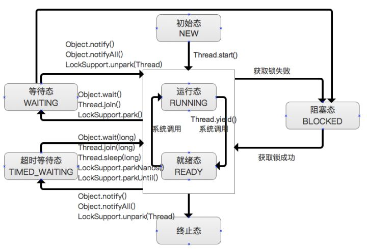
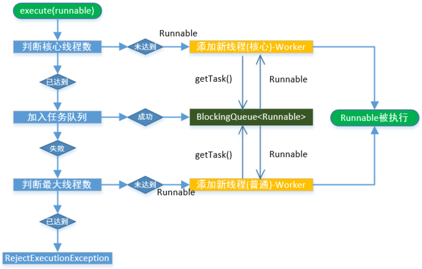

# 线程生命周期及状态转换

我们先来看看java中线程的生命周期，已经各个状态之间的转换，用一张图能比较清晰的描述：



<!--more-->

java中线程的状态一共分为6种：new、runnable、blocked、waiting、timed_waiting、terminated

### 初始态：new

创建一个`Thread`对象，但还未调用`start()`启动线程时，线程处于初始态。

### 运行态：runnable

在Java中，运行态包括`就绪态`和`运行态`。
- 就绪态
    - 该状态下的线程已经获得执行所需的所有资源，只要CPU分配执行权就能运行。
    - 所有就绪态的线程存放在就绪队列中。
- 运行态
    - 获得CPU执行权，正在执行的线程。
    - 由于一个CPU同一时刻只能执行一条线程，因此每个CPU每个时刻只有一条运行态的线程。

### 阻塞态：blocked

- 当一条正在执行的线程请求某一资源失败时，就会进入阻塞态。
- 而在Java中，阻塞态专指请求锁失败时进入的状态。
- 由一个阻塞队列存放所有阻塞态的线程。
- 处于阻塞态的线程会不断请求资源，一旦请求成功，就会进入就绪队列，等待执行。

PS：锁、IO、Socket等都资源。

### 等待：waiting

- 当前线程中调用wait、join、park函数时，当前线程就会进入等待态。
- 也有一个等待队列存放所有等待态的线程。
- 线程处于等待态表示它需要等待其他线程的指示才能继续运行。
- 进入等待态的线程会释放CPU执行权，并释放资源（如：锁）

### 超时等待：timed_waiting

- 当运行中的线程调用`sleep(time)`、`wait(time)`、`join`、`parkNanos`、`parkUntil`时，就会进入该状态；
- 它和等待态一样，并不是因为请求不到资源，而是主动进入，并且进入后需要其他线程唤醒；
- 进入该状态后释放CPU执行权和占有的资源。
- 与等待态的区别：到了超时时间后自动进入阻塞队列，开始竞争锁。

### 终止：terminated

线程执行结束后的状态。

### 注意

- `wait()`方法会释放CPU执行权 和 占有的锁。
- `sleep(long)`方法仅释放CPU使用权，锁仍然占用；线程被放入超时等待队列，与`yield`相比，它会使线程较长时间得不到运行。
- `yield()`方法仅释放CPU执行权，锁仍然占用，线程会被放入就绪队列，会在短时间内再次执行。
- `wait`和`notify`必须配套使用，即必须使用同一把锁调用；
- `wait`和`notify`必须放在一个同步块中
- 调用`wait`和`notify`的对象必须是他们所处同步块的锁对象。

# 线程池的工作原理

java线程池的核心类是`java.util.concurrent.ThreadPoolExecutor`，构造函数：
```java
public ThreadPoolExecutor(int corePoolSize,    //核心线程的数量
                          int maximumPoolSize,    //最大线程数量
                          long keepAliveTime,    //超出核心线程数量以外的线程空余存活时间
                          TimeUnit unit,    //存活时间的单位
                          BlockingQueue<Runnable> workQueue,    //保存待执行任务的队列
                          ThreadFactory threadFactory,    //创建新线程使用的工厂
                          RejectedExecutionHandler handler // 当任务无法执行时的处理器
                          ) {
    。。。
                          }
```

参数介绍如注释所示，要了解这些参数左右着什么，就需要了解线程池具体的执行方法`ThreadPoolExecutor.execute`:
```java
    public void execute(Runnable command) {
        if (command == null)
            throw new NullPointerException();
        int c = ctl.get();
        //1.当前池中线程比核心数少，新建一个线程执行任务
        if (workerCountOf(c) < corePoolSize) {
            if (addWorker(command, true))
                return;
            c = ctl.get();
        }
        //2.核心池已满，但任务队列未满，添加到队列中
        if (isRunning(c) && workQueue.offer(command)) {
            int recheck = ctl.get();
            ////如果这时被关闭了，拒绝任务
            if (! isRunning(recheck) && remove(command))
                reject(command);
            //如果之前的线程已被销毁完，新建一个线程
            else if (workerCountOf(recheck) == 0)
                addWorker(null, false);
        }
        //3.核心池已满，队列已满，试着创建一个新线程
        else if (!addWorker(command, false))
            reject(command);
    }
```

可以看到，线程池处理一个任务主要分三步处理，代码注释里已经介绍了，我再用通俗易懂的例子解释一下：

（线程比作员工，`ThreadPoolExecutor`比作团队领导，核心池比作团队中编制员工数，核心池外的比作外包员工）

1. 有了新需求，先看有没有空闲的编制，有的话就招一个编制人员来做
> 有点奇怪，为啥不利用现有空闲的编制员工？领导可能觉得先把人招满，有资源不用白不用

2. 如果编制人员已经满了，领导就把任务放到任务列表里面，编制人员自己去取任务干活
> 编制员工都很自觉，盯着领导手上的任务，干完手头上的活立马去抢，都是好员工

3. 如果任务列表满了，活太多编制员工干不完了，领导就会去招外包来干
> 虽然是外包，也很主动，干完手头上的活也去抢领导的手上的任务，悲哀的是，领导手上没有任务了，外包就自己走了，真是良心外包
> 我做外包这么多年，虽然很主动，但是赖着不走，多算人员多要钱

4. 外包也有限制，外包都到限制了，那没有办法，就要拒绝需求了
> 需求不是你想拒绝就拒绝的，产品经理不同意怎么办？开会协商定策略吧。

结合这张图，应该能明白：



前面提到的`ThreadPoolExecutor`构造函数的参数，分别影响以下内容：

- `int corePoolSize`：核心线程池数量 
    - 在线程数少于核心数量时，有新任务进来就新建一个线程，即使有的线程没事干
    - 等超出核心数量后，就不会新建线程了，空闲的线程就得去任务队列里取任务执行了
    > 编制员工
    
- `int maximumPoolSize`：最大线程数量 
    - 包括核心线程池数量 + 核心以外的数量
    - 如果任务队列满了，并且池中线程数小于最大线程数，会再创建新的线程执行任务
    > 外包员工
    
- `long keepAliveTime`：核心池以外的线程存活时间，即没有任务的外包的存活时间 
    - 如果给线程池设置`allowCoreThreadTimeOut(true)`，则核心线程在空闲时头上也会响起死亡的倒计时
    - 如果任务是多而容易执行的，可以调大这个参数，那样线程就可以在存活的时间里有更大可能接受新任务
    > 外包员工比较惨，没事干了，就得滚蛋，卸磨杀驴啊
    > 编制员工好多了，不过领导心情不好，没事干了，核心员工也得滚蛋
    
- `BlockingQueue<Runnable> workQueue`：保存待执行任务的阻塞队列 
    - 不同的任务类型有不同的选择，下一小节介绍
    > 领导手上的任务表
    
- `ThreadFactory threadFactory`：每个线程创建的地方 
    - 可以给线程起个好听的名字，设置个优先级啥的
    
- `RejectedExecutionHandler handler`：饱和策略，大家都很忙，咋办呢，有四种策略 
    - `CallerRunsPolicy`：只要线程池没关闭，直接用调用者所在线程来运行任务，就是你自己干
    - `AbortPolicy`：直接抛出`RejectedExecutionException`异常
    - `DiscardPolicy`：悄悄把任务放生，不做了
    - `DiscardOldestPolicy`：把队列里待最久的那个任务扔了，然后再调用`execute()`试试看能行不
    - 我们也可以实现自己的`RejectedExecutionHandler`接口自定义策略，比如调用`workQueue.put`方法阻塞住，需求方一直等着，只要团队有空就提需求

## 阻塞队列 workQueue

当线程池中的核心线程数已满时，任务就要保存到队列中了。

线程池中使用的队列是`BlockingQueue`接口，常用的实现有如下几种：

- `ArrayBlockingQueue`：基于数组、有界，按FIFO（先进先出）原则对元素进行排序

- `LinkedBlockingQueue`：基于链表，按FIFO（先进先出） 排序元素 
    - 吞吐量通常要高于`ArrayBlockingQueue`
    - `Executors.newFixedThreadPool()` 使用了这个队列

- `SynchronousQueue`：不存储元素的阻塞队列 
    - 每个插入操作必须等到另一个线程调用移除操作，否则插入操作一直处于阻塞状态
    - 吞吐量通常要高于`LinkedBlockingQueue`
    - `Executors.newCachedThreadPool`使用了这个队列

- `PriorityBlockingQueue`：具有优先级的、无限阻塞队列

## Executors 工厂创建线程池

### newFixedThreadPool

```java
    public static ExecutorService newFixedThreadPool(int nThreads, ThreadFactory threadFactory) {
        return new ThreadPoolExecutor(nThreads, nThreads,
                                      0L, TimeUnit.MILLISECONDS,
                                      new LinkedBlockingQueue<Runnable>(),
                                      threadFactory);
    }
```

不招外包，有固定数量核心成员的正常互联网团队。

可以看到，`FixedThreadPool`的核心线程数和最大线程数都是指定值，也就是说当线程池中的线程数超过核心线程数后，任务都会被放到阻塞队列中。

而这里选用的阻塞队列是`LinkedBlockingQueue`，使用的是默认容量`Integer.MAX_VALUE`，相当于没有上限。
> 这个坑比较大，千万要注意，阿里巴巴java开发手册明确提醒，不能直接使用Executors

### newSingleThreadExecutor

```java
    public static ExecutorService newSingleThreadExecutor() {
        return new FinalizableDelegatedExecutorService
            (new ThreadPoolExecutor(1, 1,
                                    0L, TimeUnit.MILLISECONDS,
                                    new LinkedBlockingQueue<Runnable>()));
    }
```

不招外包，只有一个核心成员的创业团队。

从参数可以看出来，`SingleThreadExecutor`相当于参数为1的`FixedThreadPool`。
 
### newCachedThreadPool

```java
    public static ExecutorService newCachedThreadPool() {
        return new ThreadPoolExecutor(0, Integer.MAX_VALUE,
                                      60L, TimeUnit.SECONDS,
                                      new SynchronousQueue<Runnable>());
    }
```

全部外包，没活最多待60秒的外包团队。

可以看到，`CachedThreadPool`没有核心线程，非核心线程数无上限，也就是全部使用外包，但是每个外包空闲的时间只有60秒，超过后就会被回收。

`CachedThreadPool`使用的队列是`SynchronousQueue`，这个队列的作用就是传递任务，并不会保存。

因此当提交任务的速度大于处理任务的速度时，每次提交一个任务，就会创建一个线程。极端情况下会创建过多的线程，耗尽CPU和内存资源。

### newScheduledThreadPool

```java
    public static ScheduledExecutorService newScheduledThreadPool(int corePoolSize) {
        return new ScheduledThreadPoolExecutor(corePoolSize);
    }
    
    public ScheduledThreadPoolExecutor(int corePoolSize) {
        super(corePoolSize, Integer.MAX_VALUE, 0, NANOSECONDS,
              new DelayedWorkQueue());
    }
```

定期维护的 2B 业务团队，核心与外包成员都有。

`ScheduledThreadPoolExecutor`继承自`ThreadPoolExecutor`， 最多线程数为`Integer.MAX_VALUE`，使用`DelayedWorkQueue`作为任务队列。

`ScheduledThreadPoolExecutor`添加任务和执行任务的机制与`ThreadPoolExecutor`有所不同。

`ScheduledThreadPoolExecutor`添加任务提供了另外两个方法：
- `scheduleAtFixedRate()`：按某种速率周期执行
- `scheduleWithFixedDelay()`：在某个延迟后执行

## 提交任务的方法

`ExecutorService`提供了两种提交任务的方法：
1. `execute()`：提交不需要返回值的任务
2. `submit()`：提交需要返回值的任务

## 关闭线程池

线程池即使不执行任务也会占用一些资源，所以在我们要退出任务时最好关闭线程池。

有两个方法关闭线程池：

1. `shutdown()`
    - 将线程池的状态设置为 SHUTDOWN，并不会立即停止
    - 停止接收外部submit的任务
    - 内部正在跑的任务和队列里等待的任务，会执行完
    - 等到上一步完成后，才真正停止

2. `shutdownNow()`
    - 将线程池设置为STOP，企图立即停止
    - 跟`shutdown()`一样，先停止接收外部提交的任务
    - 忽略队列里等待的任务
    - 尝试将正在跑的任务`interrupt`中断
    - 返回未执行的任务列表

### 等待线程结束

`awaitTermination`当前线程阻塞，直到
    - 等所有已提交的任务（包括正在跑的和队列中等待的）执行完
    - 或者等超时时间到
    - 或者线程被中断，抛出`InterruptedException`

> 优雅的关闭线程池，一般用`shutdown()`+`awaitTermination()`

# 源代码分析

前面已经描述的很清楚了，再去看源代码就很容易，不在这里写了。