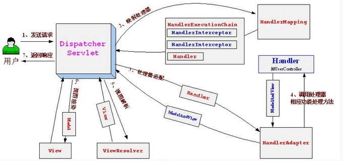

# 问题描述

spring-cloud-openfeign 很方便的将http rest服务调用转换为基于接口的rpc调用。
服务端和客户端多引用相同的Rest定义接口，服务端使用`RestController`实现该接口，客户端通过Feign生成该接口的代理，就能保证服务端和客户端的协议。
但是springMvc有个缺陷，`RestController`继承的接口能将接口类和方法上的注解都继承过来，但是方法参数的注解却无法继承。
本文提供了一种解决该问题的方案，非侵入试的巧妙的解决了该问题。

<!--more-->

# 问题还原

## hello-service-api

首先新建一个公共接口工程`hello-service-api`
> 可以参考github：[hello-service-api](https://github.com/along101/spring-boot-test/tree/master/feign-test/hello-service-api)

新建两个公共的接口，包含springMvc注解：
`HelloService1`
```java
@RequestMapping("/test1")
public interface HelloService1 {

    @RequestMapping(value = "/hello1", method = RequestMethod.GET)
    String hello(@RequestParam("name") String name);

    @RequestMapping(value = "/hello2", method = RequestMethod.GET)
    User hello(@RequestParam("name") String name, @RequestParam("age") Integer age);

    @RequestMapping(value = "/hello3", method = RequestMethod.POST)
    String hello(@RequestBody User user);

}
```

`HelloService2`
```java
@RequestMapping("/test2")
public interface HelloService2 {

    @RequestMapping(value = "/hello1", method = RequestMethod.GET)
    String hello(@RequestParam("name") String name);

    @RequestMapping(value = "/hello2", method = RequestMethod.GET)
    User hello(@RequestParam("name") String name, @RequestParam("age") Integer a);

    @RequestMapping(value = "/hello3", method = RequestMethod.POST)
    String hello(@RequestBody User user);

}
```

## hello-service-problem

新建spring boot工程`hello-service-problem`，依赖`hello-service-api`
> 可以参考github：[hello-service-problem](https://github.com/along101/spring-boot-test/tree/master/feign-test/hello-service-problem)

新建两个`RestController`，分别实现`HelloService1`、`HelloService2`两个接口。

`HelloController1`，方法参数上没有加注解
```java
@RestController
public class HelloController1 implements HelloService1 {

    @Override
    public String hello(String name) {
        return "Hello1 " + name;
    }

    @Override
    public User hello(String name, Integer a) {
        return new User(name, a);
    }

    @Override
    public String hello(User user) {
        return "Hello1 " + user.getName() + ", " + user.getAge();
    }

}
```

`HelloController2`，方法参数上加了注解
```java
@RestController
public class HelloController2 implements HelloService2 {

    @Override
    public String hello(@RequestParam("name") String name) {
        return "Hello2 " + name;
    }

    @Override
    public User hello(@RequestParam("name") String name, @RequestParam("age") Integer a) {
        return new User(name, a);
    }

    @Override
    public String hello(@RequestBody User user) {
        return "Hello2 " + user.getName() + ", " + user.getAge();
    }
}
```

启动工程，在浏览器中输入url测试两个接口：

http://localhost:8081/test1/hello2?name=along&age=12
结果：
```json
{
  "name": "along",
  "age": null
}
```

http://localhost:8081/test2/hello2?name=along&age=12
结果：
```json
{
  "name": "along",
  "age": 12
}
```

为什么第一个测试的name有值，而age为null呢？
我们看到`HelloController1.hello(String name, Integer a)`方法参数没有注解，因为没有注解，spring根据参数名称从请求参数中找值，name找到了，a没有找到，所有name有值，age为null。

第二个测试，`HelloController2.hello(@RequestParam("name") String name, @RequestParam("age") Integer a)`方法参数都有注解，spring就根据注解从请求参数中找值，都能找到，所有都不为空。

问题来了，我们继承了接口，接口方法参数上的注解没有继承过来，还要我们自己再写一遍，如果接口协议改了，实现类上的注解忘记改就悲剧了。

# 思路

问题是很明确了，如何解决呢？先看看springMvc原理，搞清楚一个请求过来，是如何反射到方法上的。

网上找到一个springMvc的原理图，描述的比较清晰：



简单的描述下，几个核心类是`DispatcherServlet`、`HandlerMapping`、`HandlerAdapter`、`HandlerMethod`、`ModelAndView`、`ViewResolver`。
- `DispatcherServlet` 处理请求的servlet，前端控制器，整个流程控制的中心，控制其它组件执行，统一调度
- `HandlerMapping` 处理映射器，根据请匹配处理器
- `HandlerAdapter` 处理适配器，将请求适配到处理器上
- `HandlerMethod` 具体的处理器，一般是Controller方法信息的封装
- `ModelAndView` 模型和视图，传递处理结果
- `ViewResolver` 视图解析器

springMvc启动的时候，会通过配置或者扫描注解将这些核心类实例化，组装到`DispatcherServlet`中。

客户端发起请求springMvc主要处理的过程如下：
1. `DispatcherServlet`根据请求在所有的`HandlerMapping`中找到匹配的`HandlerMethod`
2. `DispatcherServlet`根据找到的`HandlerMethod`，找到所支持的`HandlerAdapter`
3. `HandlerAdapter`的主要实现类是`RequestMappingHandlerAdapter`，负责从request中解析`HandlerMethod`所需要的参数，然后反射调用`HandlerMethod`中的方法，再处理返回值封装为`ModelAndView`。
4. 通过`ViewResolver`解析`ModelAndView`，处理请求返回

`HandlerMethod`中存放了调用发放的信息，属性有：
```java
public class HandlerMethod {

	/** Logger that is available to subclasses */
	protected final Log logger = LogFactory.getLog(getClass());

	private final Object bean;

	private final BeanFactory beanFactory;

	private final Class<?> beanType;

	private final Method method;

	private final Method bridgedMethod;

	private final MethodParameter[] parameters;

	private final HandlerMethod resolvedFromHandlerMethod;
。。。
}
```

属性`MethodParameter[] parameters`是方法参数数组，存放每个方法参数的信息，包括参数注解。

springMvc就是根据`MethodParameter`从request中获取信息构造方法参数数组的。

既然springMvc没有将参数注解从父接口中集成过来，我们可以自己处理。

spring生命周期中的各个阶段，我们都可以进行扩展，那么，我们可以在spring bean装配完后，修改所有`HandlerMethod`中的`parameters`，找到所继承的接口重新填充就可以了。

# 解决方案

通过调试springMvc的源代码，spring启动时，将`HandlerMapping`的实现类`RequestMappingHandlerMapping`实例化为一个bean注册到Context中，通过`getHandlerMethods`方法可以获取到所有的`HandlerMethod`。

我们只要实现一个Bean的后置处理器，修改`RequestMappingHandlerMapping`中的所有`HandlerMethod`即可，代码如下：
```java
public class HandlerMappingPostProcessor implements BeanPostProcessor {
    @Override
    public Object postProcessBeforeInitialization(Object bean, String beanName) throws BeansException {
        return bean;
    }

    @Override
    public Object postProcessAfterInitialization(Object bean, String beanName) throws BeansException {
        //找到RequestMappingHandlerMapping
        if (RequestMappingHandlerMapping.class.isAssignableFrom(ClassUtils.getUserClass(bean))) {
            RequestMappingHandlerMapping mapping = (RequestMappingHandlerMapping) bean;
            //获取所有的HandlerMethod
            Map<RequestMappingInfo, HandlerMethod> maps = mapping.getHandlerMethods();
            for (HandlerMethod handlerMethod : maps.values()) {
                //获取所有的MethodParameter
                MethodParameter[] parameters = handlerMethod.getMethodParameters();
                for (int i = 0; i < parameters.length; i++) {
                    MethodParameter parameter = parameters[i];
                    Annotation[] parameterAnnotation = parameter.getParameterAnnotations();
                    //找到接口方法
                    Method superMethod = findInterfaceMethod(parameter.getMethod());
                    if (superMethod == null) {
                        continue;
                    }
                    //接口方法参数注解
                    Annotation[][] superMethodParameterAnnotations = superMethod.getParameterAnnotations();
                    Annotation[] superParameterAnnotation = superMethodParameterAnnotations[parameter.getParameterIndex()];
                    //合并自身方法注解和接口方法注解，形成新的注解数组
                    Annotation[] newParameterAnnotation = new Annotation[parameterAnnotation.length + superParameterAnnotation.length];
                    System.arraycopy(parameterAnnotation, 0, newParameterAnnotation, 0, parameterAnnotation.length);
                    System.arraycopy(superParameterAnnotation, 0, newParameterAnnotation, parameterAnnotation.length, superParameterAnnotation.length);
                    //构造新的MethodParameter，由于SynthesizingMethodParameter参数没有公有的设置注解方法，只能新建一个
                    if (parameter instanceof SynthesizingMethodParameter) {
                        MethodParameter newParameter = new NewHandlerMethodParameter((SynthesizingMethodParameter) parameter, newParameterAnnotation);
                        parameters[i] = newParameter;
                    }
                }
            }
        }
        return bean;
    }

    /**
     * 找到方法实现的接口方法
     *
     * @param method
     * @return
     */
    private Method findInterfaceMethod(Method method) {
        Set<Class<?>> interfaces = ClassUtils.getAllInterfacesForClassAsSet(method.getDeclaringClass());
        for (Class<?> superInterface : interfaces) {
            Method superMethod = null;
            try {
                superMethod = superInterface.getMethod(method.getName(), method.getParameterTypes());
            } catch (NoSuchMethodException e) {
                //忽略异常
            }
            if (superMethod != null) {
                return superMethod;
            }
        }
        return null;
    }
}
```

代码不多，注释也很清晰的描述了整个实现的逻辑，就是找到集成的接口方法，将接口方法的注解填充到`HandlerMethod`中。这里我们新建了一个`MethodParameter`的子类`NewHandlerMethodParameter`，源代码如下：
```java
public class NewHandlerMethodParameter extends SynthesizingMethodParameter {

    private volatile Annotation[] parameterAnnotations;
    private Annotation[] newParameterAnnotation;

    public NewHandlerMethodParameter(SynthesizingMethodParameter original, Annotation[] newParameterAnnotation) {
        super(original);
        this.newParameterAnnotation = newParameterAnnotation;
    }

    /**
     * 覆盖父类方法，返回合并接口注解的数组
     *
     * @return
     */
    @Override
    public Annotation[] getParameterAnnotations() {
        if (this.parameterAnnotations == null) {
            this.parameterAnnotations = adaptAnnotationArray(newParameterAnnotation);
        }
        return this.parameterAnnotations;
    }
}
```

这里需要注意，我刚开始直继承`MethodParameter`，`getParameterAnnotations`方法直接返回`newParameterAnnotation`，是有问题的。
这里父类是`SynthesizingMethodParameter`，作用是使用方法`adaptAnnotationArray`将`newParameterAnnotation`进行改造，填充注解中属性`@AliasFor`的值。
如果没有这一步操作，会导致注解属性值不完整，比如`@RequestParam`中的`value`和`name`只填写了一个，语义上另外一个值是相同的。
实现原理是调用`AnnotationUtils.synthesizeAnnotation`方法，构造一个注解接口（注解实际上是接口）的新的动态代理对象，根据`@AliasFor`设置指定方法返回值。

新建spring-boot工程`hello-service`，将`HandlerMappingPostProcessor`注册为spring bean，复制`hello-service-problem`中的两个Controller
> 可以参考github：[hello-service](https://github.com/along101/spring-boot-test/tree/master/feign-test/hello-service)

再启动spring-boot工程进在浏览器中输入url测试两个接口：

http://localhost:8082/test1/hello2?name=along&age=12
结果：
```json
{
  "name": "along",
  "age": 12
}
```

http://localhost:8082/test2/hello2?name=along&age=12
结果：
```json
{
  "name": "along",
  "age": 12
}
```

问题解决了。


